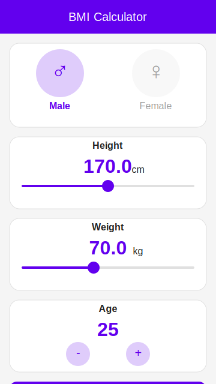

# BMI Calculator

A beautiful Flutter BMI (Body Mass Index) Calculator app with gender-specific calculations, dynamic UI, and personalized health tips.

## Features

- **Gender-Specific Calculations**: Different BMI categories for males and females
- **Dynamic UI**: Beautiful animations and transitions
- **Personalized Health Tips**: Get advice based on your BMI category
- **Age Consideration**: Factors in age for more accurate results
- **Reset Functionality**: Easily start a new calculation

## Screenshots



## How to Use

1. Select your gender (male or female)
2. Adjust the height slider to your height in cm
3. Adjust the weight slider to your weight in kg
4. Set your age using the + and - buttons
5. Press "Calculate BMI" to see your results
6. View your BMI value, category, and personalized health tip
7. Press "Reset" to start over or "Recalculate" to make adjustments

## BMI Categories

### For Males
- Underweight: BMI < 18.5
- Normal: BMI 18.5 - 24.9
- Overweight: BMI 25.0 - 29.9
- Obese: BMI ≥ 30.0

### For Females
- Underweight: BMI < 17.5
- Normal: BMI 17.5 - 23.9
- Overweight: BMI 24.0 - 28.9
- Obese: BMI ≥ 29.0

## Technical Details

- Built with Flutter and Dart
- Material Design 3 principles
- Custom animations and transitions
- Google Fonts integration
- Responsive design for various screen sizes

## Prerequisites

- Flutter SDK (version ^3.7.0)
- Dart SDK
- Android Studio / VS Code
- Android SDK / Xcode (for deployment)

## Installation

```bash
# Clone this repository
git clone https://github.com/Muhit10/day_02_bmi_calculator.git

# Go to the project directory
cd day_02_bmi_calculator

# Get dependencies
flutter pub get

# Run the app
flutter run
```

## Dependencies

- `cupertino_icons: ^1.0.8`
- `google_fonts: ^6.2.1`

## License

This project is licensed under the MIT License - see the LICENSE file for details.

## Acknowledgements

- Flutter Team for the amazing framework
- Material Design for the UI guidelines
- Google Fonts for the beautiful typography
